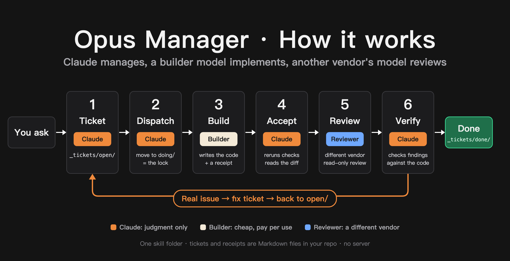

# Opus Manager

English · [中文](README.zh-CN.md)

A Claude Code skill that makes Claude the manager of your project instead of its typist. Claude plans the work as tickets, dispatches them to cheaper coding agents already on your machine, verifies the results itself, and has a model from a different vendor review the code.



## Why

Claude (Opus in particular) is strongest at judgment: breaking work down, deciding what "done" means, and telling a real bug from a false alarm. Writing the implementation is where most tokens go, and cheaper models can do that part.

With this skill, Claude's quota is spent on planning, acceptance and verification. The implementation runs on pay-per-use models. In the author's words: **a $20 Claude Pro plan starts to feel like the $200 Max plan.**

## Field numbers

Each row is one day of real use. Small sample; your numbers will differ.

| Setup | Result |
|---|---|
| A colleague (anonymous) hands a full working day to the skill | 20% of the weekly Claude Pro quota; about $5–6 on worker models |
| Work project: DeepSeek builds, GLM reviews (both via `pi`) | DeepSeek: 3,617 model calls, ~808M tokens, ~$10.24. GLM review: 206 calls, ~$0.51 |
| Author's app: Grok builds (`cursor-agent`), Gemini reviews (`agy`) | 13 tickets, 3 review rounds, 36 findings; Claude accepted and fixed 35, rejected 1 |

Worker models are billed per use, so they are not free. The saving is that Claude's quota stops going to implementation.

## How it works

1. **Ticket.** Claude writes a ticket in `_tickets/open/`: the goal, the files that may change, acceptance commands, and why those commands matter.
2. **Dispatch.** Claude moves the ticket to `_tickets/doing/` (the move is the lock), signs it with the worker and model, and runs the worker's CLI headless in the background.
3. **Receipt.** The worker writes `_receipts/<ticket>.receipt.md` with the exact commands it ran and their raw output.
4. **Acceptance.** Claude reruns every acceptance command itself and checks the diff. A receipt is a claim, not evidence.
5. **Cross-vendor code review.** A model from a different vendor reviews the change read-only and reports findings with file, line and evidence.
6. **Verification.** Claude checks each finding against the code. Real ones go back as a fix ticket; wrong ones get a one-line reason. Accepted tickets move to `_tickets/done/`.

Everything is plain Markdown in your repository: tickets, receipts, review reports, and Claude's verdicts.

## First run

The first time you use it in a project, Claude sets it up with you:

- finds which AI CLIs are installed (`cursor-agent`, `agy` / `gemini`, `codex`, `pi`, `opencode`, `aider`, …) and reads their `--help` for headless, auto-approve, model and read-only options;
- asks you, one question at a time, who builds, who reviews, which models to use, which tools may see your code, and whether workers may edit without asking;
- runs a small trial ticket and saves the result to `_tickets/workers.md`.

If you have no worker CLI yet, Claude explains the options (subscription-based or pay-per-use, where the privacy terms are) and installs the one you choose from its official source after you say yes. Sign-in and API keys stay with you.

Claude does not make privacy, cost or permission decisions for you.

## Requirements

- [Claude Code](https://code.claude.com) (Pro is enough)
- At least one other AI command-line tool, or let Claude install one on first run

## Install

Easiest: open Claude Code and say

> Install `skill/en/opus-manager` from https://github.com/yanauto/opus-manager as my personal skill.

Or by hand:

**macOS / Linux**

```bash
git clone https://github.com/yanauto/opus-manager.git
mkdir -p ~/.claude/skills
cp -R opus-manager/skill/en/opus-manager ~/.claude/skills/
```

**Windows (PowerShell)**

```powershell
git clone https://github.com/yanauto/opus-manager.git
New-Item -ItemType Directory -Force "$env:USERPROFILE\.claude\skills" | Out-Null
Copy-Item -Recurse opus-manager\skill\en\opus-manager "$env:USERPROFILE\.claude\skills\"
```

No git? On GitHub click Code → Download ZIP and copy `skill/en/opus-manager` to the same place.

Restart Claude Code afterwards.

## Use

In your project, tell Claude Code:

> Use tickets: add remember-me to the login page.

"Manage this" or "hand it off to other models" also work.

## Tip

Let it run. Cutting in mid-task makes Claude stop and verify what you said, which costs quota. Speak up for real decisions; keep passing thoughts for later.

## Status

- macOS: full workflow used daily.
- Windows: installation and tool discovery confirmed by one user; a full ticket run is not yet confirmed.
- Linux: expected to work, not yet tested.

## License

MIT
