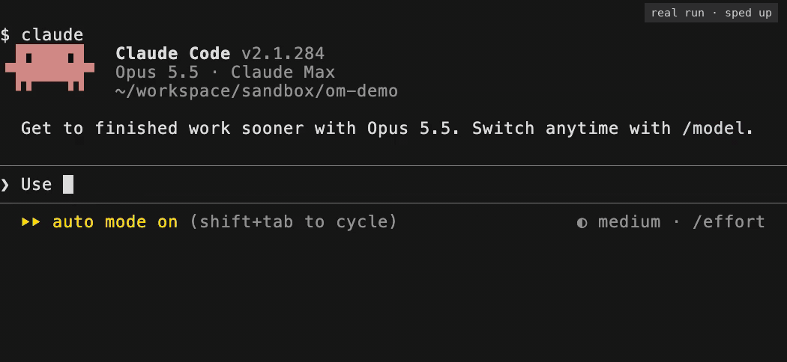
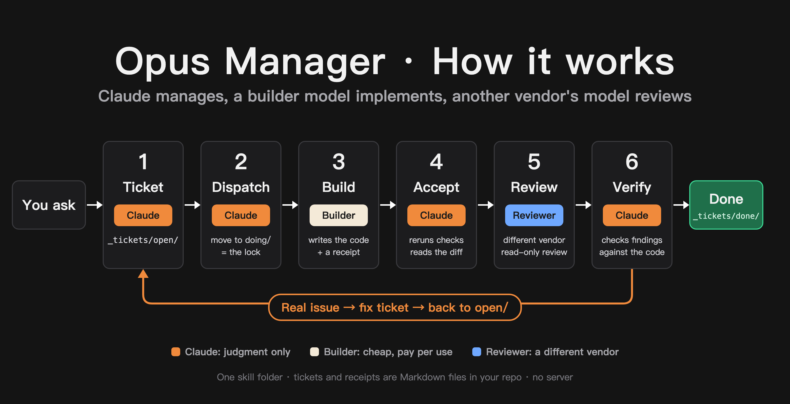

# Opus Manager

English · [中文](README.zh-CN.md)

> 国内下载 (China mirror): [yan-auto.me/zh/downloads/opus-manager](https://yan-auto.me/zh/downloads/opus-manager/)

**Unattended.** Hand the work over and walk away.

A Claude Code skill that makes Claude the manager of your project instead of its typist. Claude plans the work as tickets, dispatches them to cheaper coding agents already on your machine, verifies the results itself, has a model from a different vendor review the code, and keeps going while you are gone.



*A real run. It took about 4 minutes; the GIF plays most of it at 20× speed. Claude writes the ticket, DeepSeek builds it, Claude reruns the checks and commits, GLM reviews, Claude checks each finding.*

## Why

### It keeps going while you're away

Tell Claude what you want done and leave. It asks the questions it would otherwise interrupt you with before you go, then works down the queue: dispatch, accept, review, fix, next. Decisions it may not make alone go into a list for you, and it carries on with other tickets. When you are back, a short report tells you what works, what is waiting for you, and what it cost.

Two real runs:

- **A colleague's release day (a recruiting SaaS).** He left at 17:30. It kept going on its own until 22:28: 9 tickets through build → review by a second vendor → fix → release → live check, including 2 skipped reviews it caught and ran itself. He checked in once. A morning report came out at 08:30 the next day.
- **The author's work project, overnight.** 00:23 to 07:45, 7.4 hours with no messages from him: Claude claimed 9 tickets and got 10 receipts back from workers.

What can stop it: the computer going to sleep, a permission prompt nobody answers, and Claude's own usage limits. On a Pro plan, one busy morning used about 83% of a 5-hour window. When the limit is hit Claude stops; workers already started finish, and after the reset you tell it to continue.

### Your Claude quota goes to judgment

Claude (Opus in particular) is strongest at judgment: breaking work down, deciding what "done" means, and telling a real bug from a false alarm. Writing the implementation is where most tokens go, and cheaper models can do that part.

With this skill, Claude's quota is spent on planning, acceptance and verification. The implementation runs on pay-per-use models. In the author's words: **a $20 Claude Pro plan starts to feel like the $200 Max plan.**

### Why the manager never writes code

Saving quota is only part of it. The bigger point is keeping Claude's context clean.

When Claude writes code itself, its context fills up with code: files it opened, diffs, test logs, failed attempts. The plan, what "done" means, and why earlier decisions were made get pushed aside or compacted away.

Here Claude only sees tickets, receipts, the diff of each ticket and review findings. The implementation happens in a separate CLI tool's session. So Claude keeps its view of the whole project and keeps making decisions: what comes next, whether a result is really done, which review findings are real bugs and which are false alarms.

What that gets you:

- **The project keeps moving.** A friend's project had been stuck for about two months on DeepSeek and GLM, then on GPT. With Claude managing and DeepSeek building, most of it moved forward in two days. One project, one data point.
- **You can step away.** Claude plans, dispatches, verifies and sends fixes back on its own, as in the colleague's run above. You come back to the decisions that are actually yours.

## Field numbers

Each row is one day of real use. Small sample; your numbers will differ.

| Setup | Result |
|---|---|
| A colleague (anonymous) hands a full working day to the skill | 20% of the weekly Claude Pro quota; about $5–6 on worker models |
| Work project: DeepSeek builds, GLM reviews (both via `pi`) | DeepSeek: 3,617 model calls, ~808M tokens, ~$10.24. GLM review: 206 calls, ~$0.51 |
| Recruiting SaaS launch sprint day: DeepSeek and GPT build, GLM reviews (all via `pi`) | DeepSeek: 3,528 calls, ~906M tokens, ~$10.5. GPT: 1,135 calls on a Codex subscription. GLM review: 283 calls, ~$0.9. About 12 tickets went through cross-vendor review. [Details](https://github.com/yanauto/opus-manager/issues/1) |
| Author's app: Grok builds (`cursor-agent`), Gemini reviews (`agy`) | 13 tickets, 3 review rounds, 36 findings; Claude accepted and fixed 35, rejected 1 |

**Over a longer stretch**: in 8 weeks (2026-08-02 to 09-28) the author dispatched 360 tickets across 13 repositories: 340 accepted, 12 dropped, and about one in ten needed a follow-up fix. Of the 227 tickets that recorded their worker, Grok built 131, DeepSeek 81 and Gemini 15. On one work project, Claude checked about 70 cross-vendor review findings one by one: about 61 held up and 4 did not.

Worker models are billed per use, so they are not free. The saving is that Claude's quota stops going to implementation.

## How it works



1. **Ticket.** Claude writes a ticket in `_tickets/open/`: the goal, the files that may change, acceptance commands, and why those commands matter.
2. **Dispatch.** A dispatch script that Claude writes on first run moves the ticket to `_tickets/doing/` (the move is the lock), signs it with the real worker and model, and starts the worker headless. The worker runs detached from Claude's session, so a session restart does not stop it.
3. **Receipt.** The worker writes `_receipts/<ticket>.receipt.md` with the exact commands it ran and their raw output.
4. **Acceptance.** Claude reruns every acceptance command itself and checks the diff. A receipt is a claim, not evidence.
5. **Cross-vendor code review.** A model from a different vendor reviews the change read-only and reports findings with file, line and evidence.
6. **Verification.** Claude checks each finding against the code. Real ones go back as a fix ticket; wrong ones get a one-line reason. Accepted tickets move to `_tickets/done/`.

Everything is plain Markdown in your repository: tickets, receipts, review reports, and Claude's verdicts.

## First run

The first time you use it in a project, Claude sets it up with you:

- finds which AI CLIs are installed (`cursor-agent`, `agy` / `gemini`, `codex`, `pi`, `opencode`, `aider`, …) and reads their `--help` for headless, auto-approve, model and read-only options;
- asks you, one question at a time, who builds, who reviews, which models to use, which tools may see your code, and whether workers may edit without asking;
- writes a dispatch script and a review script for your shell, so every ticket is claimed, signed and started the same way;
- runs a small trial ticket and saves the result to `_tickets/workers.md`.

If you have no worker CLI yet, Claude explains the options (subscription-based or pay-per-use, where the privacy terms are) and installs the one you choose from its official source after you say yes. Sign-in and API keys stay with you.

Claude does not make privacy, cost or permission decisions for you.

## Requirements

- [Claude Code](https://code.claude.com) (Pro is enough)
- At least one other AI command-line tool, or let Claude install one on first run. The author recommends the open-source [pi](https://pi.dev) with an [OpenCode Go](https://opencode.ai/go) subscription: one subscription covers several model vendors, $10 a month when this was written

## Install

Easiest: open Claude Code and say

> Install `skill/en/opus-manager` from https://github.com/yanauto/opus-manager as my personal skill.

Or by hand:

**macOS / Linux**

```bash
git clone https://github.com/yanauto/opus-manager.git
mkdir -p ~/.claude/skills
cp -R opus-manager/skill/en/opus-manager ~/.claude/skills/
```

**Windows (PowerShell)**

```powershell
git clone https://github.com/yanauto/opus-manager.git
New-Item -ItemType Directory -Force "$env:USERPROFILE\.claude\skills" | Out-Null
Copy-Item -Recurse opus-manager\skill\en\opus-manager "$env:USERPROFILE\.claude\skills\"
```

No git? On GitHub click Code → Download ZIP and copy `skill/en/opus-manager` to the same place.

Restart Claude Code afterwards.

## Use

In your project, tell Claude Code:

> Use tickets: add remember-me to the login page.

"Manage this" or "hand it off to other models" also work.

To leave it running, say so:

> I'm off for the evening. Run this unattended: fix the checkout bug, then add CSV export.

Claude agrees with you on what it may do without asking, writes the queue to `_tickets/queue.md`, and keeps a one-line-per-ticket log in `_receipts/progress.md` that you can read instead of asking how it is going.

## Tip

Let it run. Cutting in mid-task makes Claude stop and verify what you said, which costs quota. Speak up for real decisions; keep passing thoughts for later.

## Status

- macOS: full workflow used daily.
- Windows: installation and tool discovery confirmed by one user; a full ticket run is not yet confirmed.
- Linux: expected to work, not yet tested.

## Contributing

Issues and PRs are welcome. See [CONTRIBUTING.md](CONTRIBUTING.md).

## License

MIT
