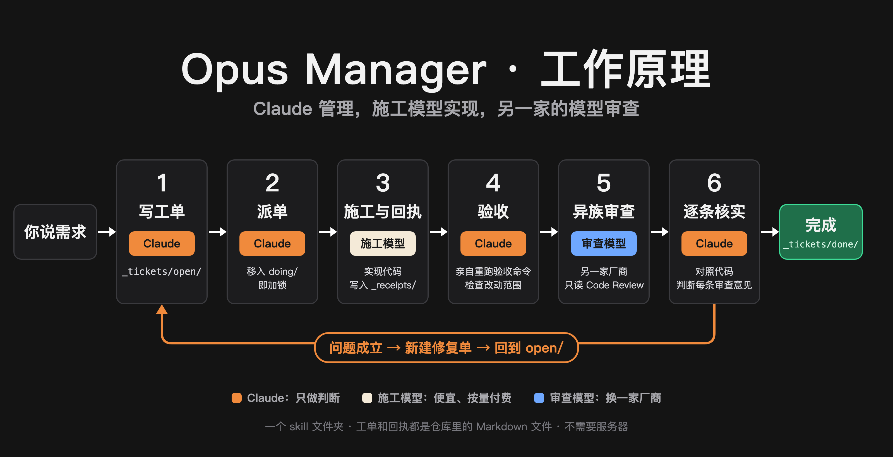

# Opus Manager · 工单托管

[English](README.md) · 中文

一个 Claude Code skill，让 Claude 当项目经理，不当码农。Claude 把需求拆成工单，派给你电脑上更便宜的编程 Agent 去实现，自己验收结果，再交给另一家厂商的模型做异族 Code Review。



## 为什么

Claude（尤其是 Opus）最强的是判断：怎么拆任务、什么算做完、审查意见里哪条是真 bug。写实现代码最耗 token，而这部分交给便宜模型也能做好。

用这个 skill，Claude 的额度只花在**刀刃**上：规划、验收、核实审查意见。实现代码由按量付费的模型来写。

用作者自己的话说：**20 美元的 Claude Pro，用出了 200 美元 Max 的感觉。**

## 实测数据

每一行都是真实使用的一天。样本很少，你的数字会不一样。

| 场景 | 结果 |
|---|---|
| 一位同事（匿名）把一整个工作日交给它托管 | 用掉 Claude Pro 周额度的 20%；工人模型花费约 5–6 美元 |
| 作者的一个工作项目：DeepSeek 施工，GLM 审查（都通过 `pi`） | DeepSeek：调用 3,617 次，约 8.08 亿 token，约 10.24 美元。GLM 审查：调用 206 次，约 0.51 美元 |
| 作者自己的 App：Grok 施工（`cursor-agent`），Gemini 审查（`agy`） | 13 张工单，3 轮异族 Code Review，36 条审查意见；Claude 核实后采纳并修复 35 条，驳回 1 条 |

工人模型按用量计费，不是免费的。省下来的是 Claude 的额度：它不再花在写实现代码上。

## 工作流程

1. **写工单**：Claude 在 `_tickets/open/` 写工单：目标、允许修改的文件、验收命令，以及为什么这样验收。
2. **派单**：Claude 把工单移到 `_tickets/doing/`（移动即加锁），在工单上签上工人和模型，然后在后台以无头模式运行工人的命令行。
3. **回执**：工人写 `_receipts/<工单>.receipt.md`，贴出实际执行的命令和原始输出。
4. **验收**：Claude 亲自重跑每条验收命令，并检查改动范围。回执只是工人的说法，不是证据。
5. **异族 Code Review**：另一家厂商的模型以只读方式审查改动，每条意见附文件、行号和代码证据。
6. **核实**：Claude 对照代码逐条核实。成立的打包成修复单重新派出，不成立的写明理由。验收通过的工单移到 `_tickets/done/`。

工单、回执、审查报告和 Claude 的核实结论，都以 Markdown 文件保存在你的仓库里。

## 第一次使用

第一次在某个项目里使用时，Claude 会和你一起完成配置：

- 查找本机装了哪些 AI 命令行工具（`cursor-agent`、`agy` / `gemini`、`codex`、`pi`、`opencode`、`aider` 等），读它们的 `--help`，弄清无头运行、自动放行、选择模型和只读模式的参数；
- 一次问一个问题：谁施工、谁审查、用什么模型、哪些工具可以访问你的代码、是否允许工人不经确认直接修改文件；
- 跑一张很小的试用工单，把结果保存到 `_tickets/workers.md`。

如果还没有任何工人工具，Claude 会说明几类选择（订阅制还是按量付费、隐私条款在哪里），你选定并同意后，它从官方渠道帮你安装。登录和 API Key 由你自己填写。

涉及隐私、费用和权限的决定，Claude 不会替你做。

## 环境要求

- [Claude Code](https://code.claude.com)（Pro 即可）
- 至少一个其他 AI 命令行工具；没有的话，第一次使用时让 Claude 帮你装

## 安装

最省事的办法：打开 Claude Code，对它说：

> 帮我把 https://github.com/yanauto/opus-manager 里的 `skill/zh/opus-manager` 装成我的个人 skill。

也可以手动安装：

**Mac / Linux**

```bash
git clone https://github.com/yanauto/opus-manager.git
mkdir -p ~/.claude/skills
cp -R opus-manager/skill/zh/opus-manager ~/.claude/skills/
```

**Windows（PowerShell）**

```powershell
git clone https://github.com/yanauto/opus-manager.git
New-Item -ItemType Directory -Force "$env:USERPROFILE\.claude\skills" | Out-Null
Copy-Item -Recurse opus-manager\skill\zh\opus-manager "$env:USERPROFILE\.claude\skills\"
```

没装 git 的话，在 GitHub 页面点 Code → Download ZIP，解压后把 `skill/zh/opus-manager` 这个文件夹复制到上面的位置。

装好后重新打开 Claude Code。

## 使用

在你的项目里打开 Claude Code，说：

> 走工单：给登录页加上「记住我」。

说「托管」或「派给别的模型做」也可以。

## 建议

放手让它托管。中途插话会让 Claude 停下来核实你说的话，反而消耗额度。有新决定再说，临时的想法先记下来。

## 当前状态

- macOS：完整流程日常在用。
- Windows：一位用户已确认安装和工具查找正常，完整的派单流程尚未确认。
- Linux：按设计可用，尚未测试。

## 许可证

MIT
